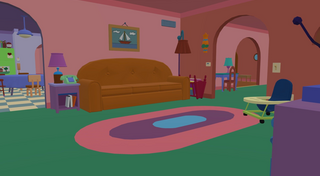

# Simpsons House — a PlayStation Home scene

A playable recreation of the Simpsons family home as a PlayStation Home public lobby,
built from the assets of *The Simpsons Game* (2007, PS3) and adapted by **Douezino**.



| | |
|---|---|
| Scene name | `simpsons` |
| Title shown in the XMB | Simpsons House |
| SceneID | `0a5a9d00-ed8c-018d-370a-60e20516dba2` |
| HOMEUID | `2003` |
| Type | `PublicLobby` |
| Config path | `environments/simpsons/simpsons.scene` |
| Archive | SHARC inside an SDAT, big-endian, 53 files |

## What's in the scene

The whole interior, walkable, with per-face collision rasterised from the geometry rather
than a box per object — floors, walls, worktops and the staircase are all solid, and the
first-floor landing is reachable.

- **12 seats** (`sitDownGameType`), hand placed on the sofas, chairs and beds.
- **3 ambient sound zones** (`spherePointSoundType`, MP3): the Simpsons theme in the living
  room, street noise at the front door, a workshop hum in the garage. Each has its own
  falloff so they stay in their room.
- **A working television** in the living room: a `videoScreenType` with Sony's native
  interaction panel and full-screen zoom. The CRT bulge was cut from the model so the video
  sits flush in the frame.
- **Inked outlines** on the geometry, to match the cel-shaded look of the source game.

## Files

| File | Goes to | Size |
|---|---|---|
| `scene/simpsons_T001.SDAT` | `Scenes/Simpsons/` on the content server | 10 999 280 B |
| `scene/simpsons_T001.sdc` | wherever you serve scene descriptors from | 1 339 B |
| `thumbnails/large_T001.png` | `Scenes/Simpsons/` | 320×176 |
| `thumbnails/small_T001.png` | `Scenes/Simpsons/` | 324×152 |
| `media/simpsons_tv.mp4` | `Scenes/Simpsons/` | 11 371 420 B |

Everything except the SDC goes in the **same folder** on the CDN. That is not a convention
we picked: `[THUMBNAIL_ROOT]` in the SDC resolves to the archive's own directory, which we
confirmed by hashing `…/Scenes/FarCry2TrainStation/large_T001.png` and landing exactly on the
cached thumbnail the XMB shows for Sony's Far Cry 2 train station.

Thumbnail sizes are the ones the HDK requires: the large one is 320x176 with no reserved
margin, the small one is **128x128 square** — small *environment* thumbnails are the exception to
the 13-pixel blank bands that object thumbnails carry, and both should fill their whole canvas.
Every scene needs both.

Checksums are in [`CHECKSUMS.md5`](CHECKSUMS.md5).

## Installing it

### 1. Upload

Put these four files in `Scenes/Simpsons/` under your content root:

```
simpsons_T001.SDAT
large_T001.png
small_T001.png
simpsons_tv.mp4
```

The SDC references them through `[CONTENT_SERVER_ROOT]` and `[THUMBNAIL_ROOT]`, so no path
inside it needs editing if you keep that layout.

### 2. Serve the SDC

`scene/simpsons_T001.sdc` is **plaintext**. If your pipeline expects it encrypted, encrypt it
the way you do the others. Its content:

```xml
<NAME>Simpsons House</NAME>
<DESCRIPTION>From The Simpsons Game (2007, PS3), distributed by Electronic Arts. Modified and adapted by Douezino.</DESCRIPTION>
<MAKER_IMAGE />
<SMALL_IMAGE>[THUMBNAIL_ROOT]small_T001.png</SMALL_IMAGE>
<LARGE_IMAGE>[THUMBNAIL_ROOT]large_T001.png</LARGE_IMAGE>
<ARCHIVES>
  <ARCHIVE size="10999280" timestamp="B1868B28">[CONTENT_SERVER_ROOT]Scenes/Simpsons/simpsons_T001.SDAT</ARCHIVE>
</ARCHIVES>
```

Declared for `en-US` and `en-GB`. Add other regions if you need them; the client falls back
on its own.

### 3. List the scene

For a client-side install via `LOCALSCENELIST.XML`, this is the entry — each player needs it
along with the SDAT:

```xml
<SCENE Name="simpsons" SceneID="0a5a9d00-ed8c-018d-370a-60e20516dba2" Type="PublicLobby"
       HOMEUID="2003" version="1" KEYWORDS="Home" config="environments/simpsons/simpsons.scene" />
```

If you instead publish it through a server-side `SceneList.xml`, that format wants a `sha1`
attribute holding the **SHA-1 of the SDC plaintext**. For the file as shipped:

```
71f40ef4436836d27c47f408dbff33d6b8495dc0
```

Recompute it if you change the SDC at all, or the client will refuse to enter the scene.

## Two things that will bite you

**The archive size and timestamp in the SDC are checked byte for byte.** The SDC declares
`size="10999280"` and `timestamp="B1868B28"`. If the SDAT is ever repacked, both have to be
updated or the client fails the mount with `SEC: Failed to mount ..., result=-6` and hangs on
*Downloading and preparing scene*.

**The television video's declared profile level is load-bearing.** `simpsons_tv.mp4` is MPEG-4
Part 2, `mp4v`, 640x352, 29.97 fps, AAC-LC 44.1 kHz stereo, and its VOS header declares **Simple
Profile Level 3** (`profile_and_level_indication = 0x03`). That byte is not cosmetic: the HDK
documents that the client reads the profile level from the metadata and sizes its buffers from
it, and that if the level is declared lower than the content needs, it allocates too little and
*the video does not play*. An earlier build of this file declared Level 1 — which budgets for
176x144 — and stalled a few seconds in, then looped, with nothing in any log. Sony's own scene
videos declare Level 3 at 640x352 and 720x406, so this file matches them deliberately.

H.264 is supported too (up to Level 3.0 outside video spaces), but it costs 25.96 MB of screen
MAIN memory at Level 3 against 7.19 MB for this, which is poor value for a living-room TV.

If you re-encode, keep the level explicit and check the byte afterwards:

```sh
ffmpeg -i <source> -c:v mpeg4 -vtag mp4v -profile:v 0 -level 3 -bf 0 -pix_fmt yuv420p \
       -s 640x352 -r 30000/1001 -g 150 -b:v 1090k -maxrate 1400k -bufsize 1800k \
       -c:a aac -profile:a aac_low -ar 44100 -ac 2 -b:a 128k \
       -brand mp42 -movflags +faststart <out>.mp4
```

`-bf 0` matters as well: Simple Profile forbids B-frames. Video is stretched to fit the screen,
so the 20:11 frame on a 16:9 panel is intentional and costs nothing.

## Credits and legal

Original assets from **The Simpsons Game** (2007, PlayStation 3), distributed by **Electronic
Arts**. *The Simpsons* is a trademark of Twentieth Century Fox Film Corporation.

Scene adapted, rebuilt and assembled for PlayStation Home by **Douezino**. This is a
non-commercial fan project for a community preservation server, offered with no affiliation to
or endorsement by any rights holder. If you hold rights to this material and want it taken
down, open an issue and it will be removed.
